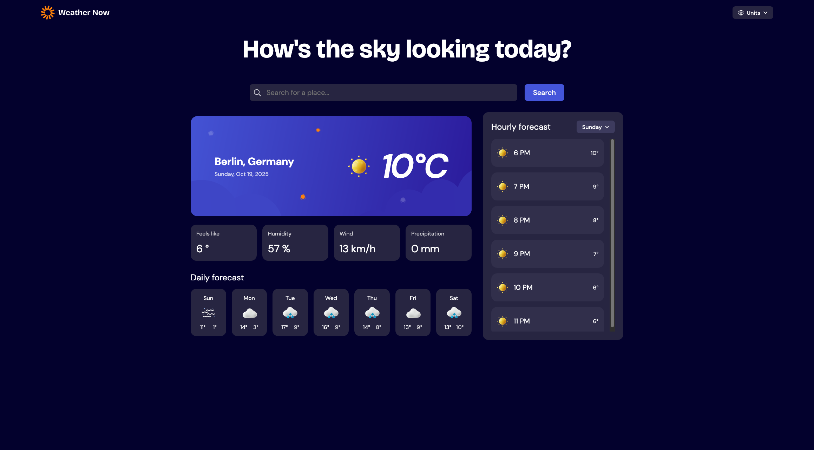

# Frontend Mentor - Weather app solution

This is a solution to the [Weather app challenge on Frontend Mentor](https://www.frontendmentor.io/challenges/weather-app-K1FhddVm49). Frontend Mentor challenges help you improve your coding skills by building realistic projects.

## Table of contents

- [Overview](#overview)
  - [The challenge](#the-challenge)
  - [Screenshot](#screenshot)
  - [Links](#links)
- [My process](#my-process)
  - [Built with](#built-with)
  - [What I learned](#what-i-learned)
  - [Continued development](#continued-development)
- [Author](#author)

## Overview

### The challenge

Users should be able to:

- Search for weather information by entering a location in the search bar
- View current weather conditions including temperature, weather icon, and location details
- See additional weather metrics like "feels like" temperature, humidity percentage, wind speed, and precipitation amounts
- Browse a 7-day weather forecast with daily high/low temperatures and weather icons
- View an hourly forecast showing temperature changes throughout the day
- Switch between different days of the week using the day selector in the hourly forecast section
- Toggle between Imperial and Metric measurement units via the units dropdown
- Switch between specific temperature units (Celsius and Fahrenheit) and measurement units for wind speed (km/h and mph) and precipitation (millimeters) via the units dropdown
- View the optimal layout for the interface depending on their device's screen size
- See hover and focus states for all interactive elements on the page

### Screenshot

### Links

- Solution URL: [https://github.com/LUKASZ-JK/fem-weather-app](https://github.com/LUKASZ-JK/fem-weather-app)
- Live Site URL: [https://lukasz-jk.github.io/fem-weather-app](https://lukasz-jk.github.io/fem-weather-app)

## My process

### Built with

- [React](https://react.dev/)
- [TypeScript](https://www.typescriptlang.org/)
- [Zustand](https://zustand-demo.pmnd.rs/) - State management
- [shadcn](https://ui.shadcn.com/) - Pre-built components
- [Tailwind CSS](https://tailwindcss.com/) - Styling
- [Zod](https://zod.dev/) - For schema validation

### What I learned

This was the first project in which I used Tailwind for styling. Using inline utility classes is a different approach from classic CSS, but I have found it very intuitive.
It has been a fun project that involved working with external APIs and displaying data in a user-friendly manner.

### Continued development

Building my own backend to create something truly full-stack.

## Author

- Website - [Łukasz Jędrzejczyk](https://github.com/LUKASZ-JK/)
- Frontend Mentor - [@LUKASZ-JK](https://www.frontendmentor.io/profile/LUKASZ-JK)
